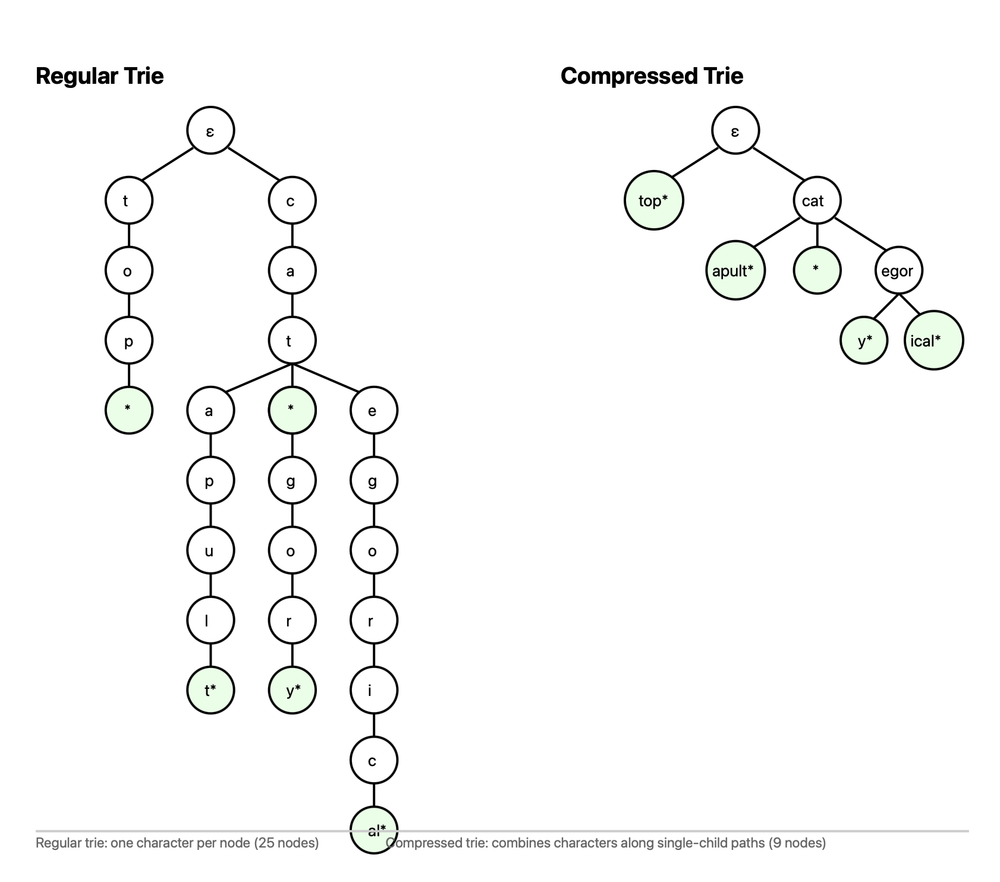

# Homework 4: The Numerican Dictionary (25 points)

## :sparkles: Lore: A Numerica Education Initiative

Thanks to your efforts, the efficiency of task completion has skyrocketed across Numerica. This has caused major advancements in the Numerican economy, which in turn has created demand for an educated labor force. In particular, workers need to know what is meant when they are asked to "Commence the meticulous aggregation of ligneous fragments dispersed across the terrain, ensuring a thorough reconnaissance to procure suitably combustible specimens." (Collect firewood)

The Council is tasking you with creating an information tool called a `Dictionary` which will allow users to efficiently search up the definitions of words, and store the definitions in a space efficient format.

## :scroll: Problem Description

Implement a Java class called `Dictionary` that stores words, can be queried for the definitions of those words.

The class should have a constructor as follows:

`Dictionary()`: Initializes the Dictionary.

The class should implement the following methods:

1. `void add(String word, String definition)`: Adds a word to the dictionary and stores its definition. If the word is already in the dictionary, this method will change its definition.

2. `void remove(String word)`: Removes a word from the dictionary.

3. `String getDefinition(String word)`: Returns the stored definition associated with the word, null if the word is not in the dictionary.

4. `int countPrefix(String prefix)`: Returns the number of words in the dictionary with the given prefix.

5. `void compress()`: After calling this method, the add and remove methods of the dictionary will not be called.

6. `String getSequence(String word)`: Returns a representation of the sequence of nodes which would store the word in a compressed trie, null if the word is not in the Dictionary. In the following example `getSequence("category")` would return `"cat-egor-y"`. This method will not be called until `compress()` is called.




**Note: You only need to consider lower-case alphabetical characters in words.**

## :briefcase: Requirements

1. Implement the `Dictionary` class in `Dictionary.java`.
2. The class should efficiently handle a large number of words (up to 100,000).
3. Implement all the methods described in the problem description.
4. Optimize for efficient addition, removal, getDefinition, and getSequence operations

**Important Note:** As with previous homework assignments, most Java standard collections libraries (e.g., `HashMap`, `PriorityQueue`, etc.) are not to be used. However, you may import java.util.List, java.util.ArrayList, java.util.LinkedList, and java.util.Random which may assist you in this assignment. Primitive data types and their arrays (e.g., `String[] dependencies`) can be used. However, you are encouraged to implement your own data structures using classes. You can either create new classes in the same file or create new files and submit them alongside `Dictionary.java`.

## :footprints: Example Dictionary Operations

Consider the following sequence of operations:

1. `add("cat", "A small domesticated carnivorous mammal")`
2. `add("category", "A class or division of things")`
3. `add("categorize", "The act of creating categories")`
4. `add("catapult", "A device for hurling objects")`
5. `getDefinition("cat")` returns `"A small domesticated carnivorous mammal"`
6. `countPrefix("cata")` returns `1`
7. `countPrefix("cat")` returns `4`
8. `remove("cat")`
9. `compress()`
10. `getSequence("catapult")` returns `"cat-apult"`
11. `getSequence("category")` returns `"cat-egor-y"`
12. `countPrefix("cat")` returns `3`
13. `getDefinition("cat")` returns `null`
14. `countPrefix("ca")` returns `3`

## :envelope: Submission Details

For this assignment, you will submit your `Dictionary.java` file and any additional files you create through Gradescope.

__Submission link:__ [https://www.gradescope.com/courses/965721/assignments/6050536](https://www.gradescope.com/courses/965721/assignments/6050536)


__Deadlines:__  April 18th, 2025 at 11:59 PM EST (10 days from the release of the assignment). 
__Release Date:__  April 10th, 2025 at 11.59 PM EST. 
__Late Due Date:__ May 10th, 2025 at 11.59 PM EST.


## :bar_chart: Evaluation:

### Procedure

- __Initialization:__ The `Dictionary` object is initialized with no words.
- __Operations:__ The methods can be invoked in any arbitrary order, as long as they are valid.
- __Testing:__ We will test your implementation with various test cases, each containing different sequences of operations. Based on how many and which test cases your implementation passes, we will assign you a score between 0 and 25 points. 

### Criteria

- __Correctness:__ Does the implementation correctly handle all operations on the task collection?
- __Efficiency:__ Does the implementation have a reasonable time and space complexity?
- __Time Complexity:__ For full credit, each operation should take no more than O(N) time, where N is the number of characters in the word argument

__Grading Bonus:__ Bonus points (+5) will be awarded for submissions that pass all the provided public test cases.

## :rocket: Starter Code

Begin your quest with this [`Dictionary.java`](Dictionary.java) file. Make sure to adhere to the requirements and constraints provided in the problem description, and do not use any disallowed Java standard collection libraries.

### Evaluation Script

We will use a script similar to [`Evaluator.java`](Evaluator.java) to evaluate the correctness and efficiency of your implementation. You may run the script locally to evaluate your implementation.

Steps to run the evaluation script:
```bash
# Make sure you have Java installed on your computer
java -version

# Navigate to the problems/hw2 directory
cd problems/hw4

# Compile the Evaluator.java file
javac Evaluator.java Dictionary.java

# Run the Evaluator file with a single test case
java Evaluator tests/tc_00_basic.txt

# Run the Evaluator file with all public test cases
java Evaluator tests/

# You can create your own test cases to test your implementation
```

### ✨ Extra Tips
1. Consider defining your own Node class to manage character transitions and metadata.

2. For compress(), a recursive helper that performs post-order merging may be useful.

3. Avoid traversing the entire trie for each operation — local traversal by character should be sufficient for O(N)-time behavior.
